# 1. Introduction

This project is a data visualization analysis of the salary data of data
science professionals. The goal of this project is to understand and
visualize the factors that influence data science salaries, such as
experience level, job title, and geographic location.

The data for this project comes from a dataset of data science job
salaries, which includes information on the salary, experience level,
job title, employment type, and location of each data science
professional. The dataset contains information on a total of 607 data
science professionals.

Overall, this project provides valuable insights into the data science
job market, and can be useful for data science professionals looking to
understand the factors that influence their salary.

# 2. Importing Libraries

In this section, we will import the necessary libraries for the project.
Libraries are collections of functions and data that can be used to
perform specific tasks, such as data manipulation, visualization, and
statistical analysis.

To import the libraries, we will use the library() function in R. We
will specify the name of the library as an argument to the function. For
example, to import the tidyverse library, we would use the following
code: library(tidyverse).

In this project, we will be using several libraries, including
tidyverse, rnaturalearth, sf, and dplyr.

We will also check if the rnaturalearthhires library is installed, and
if not, we will install it using the renv package.

Finally, we will use the sf::sf_use_s2() function to disable S2
geometries in the sf library.

By the end of this section, we will have all the necessary libraries
imported and ready for use in the project.

``` r
library(tidyverse)
library(rnaturalearth)
library(sf)
library(dplyr)

if (!require(rnaturalearthhires)) {
  if (!require(renv)) {
    install.packages("renv")
  }
  renv::install("rnaturalearth", "ropensci/rnaturalearthhires")
}

sf::sf_use_s2(FALSE)
```

# 3. Importing The Dataset

In this section, we will import the data science job salaries dataset
into our analysis. This will involve reading the dataset from a file or
database, and storing it in a data structure such as a tibble.

To import the dataset, we will use the read_csv() function from the
tidyverse package. This function will allow us to read a CSV file and
store it as a tibble, which is a modern data frame that is optimized for
working with data in R.

We will also specify the location of the dataset file, either by
providing a file path or URL.

By the end of this section, we will have the data science job salaries
dataset imported and stored as a tibble, ready for further analysis.

``` r
salaries <- read_csv("./data/ds_salaries.csv")
salaries <- select(salaries, -1)
head(salaries)
```

    ## # A tibble: 6 × 11
    ##   work_…¹ exper…² emplo…³ job_t…⁴ salary salar…⁵ salar…⁶ emplo…⁷ remot…⁸ compa…⁹
    ##     <dbl> <chr>   <chr>   <chr>    <dbl> <chr>     <dbl> <chr>     <dbl> <chr>  
    ## 1    2020 MI      FT      Data S…  70000 EUR       79833 DE            0 DE     
    ## 2    2020 SE      FT      Machin… 260000 USD      260000 JP            0 JP     
    ## 3    2020 SE      FT      Big Da…  85000 GBP      109024 GB           50 GB     
    ## 4    2020 MI      FT      Produc…  20000 USD       20000 HN            0 HN     
    ## 5    2020 SE      FT      Machin… 150000 USD      150000 US           50 US     
    ## 6    2020 EN      FT      Data A…  72000 USD       72000 US          100 US     
    ## # … with 1 more variable: company_size <chr>, and abbreviated variable names
    ## #   ¹​work_year, ²​experience_level, ³​employment_type, ⁴​job_title,
    ## #   ⁵​salary_currency, ⁶​salary_in_usd, ⁷​employee_residence, ⁸​remote_ratio,
    ## #   ⁹​company_location

# 4. Data Preparation

It’s always a good idea to check for missing values in the dataset, as
these can cause errors or bias in our analysis. We can use functions
such as is.na() or summarize_all() to identify which columns have
missing values and how many.

``` r
# Check for missing values in all columns
summarize_all(salaries, funs(sum(is.na(.))))
```

    ## # A tibble: 1 × 11
    ##   work_…¹ exper…² emplo…³ job_t…⁴ salary salar…⁵ salar…⁶ emplo…⁷ remot…⁸ compa…⁹
    ##     <int>   <int>   <int>   <int>  <int>   <int>   <int>   <int>   <int>   <int>
    ## 1       0       0       0       0      0       0       0       0       0       0
    ## # … with 1 more variable: company_size <int>, and abbreviated variable names
    ## #   ¹​work_year, ²​experience_level, ³​employment_type, ⁴​job_title,
    ## #   ⁵​salary_currency, ⁶​salary_in_usd, ⁷​employee_residence, ⁸​remote_ratio,
    ## #   ⁹​company_location

Perfect! Our dataset does not contain any missing values. Also it looks
like the dataset does not need any further steps of data cleaning, but
we can do some improvements to have more readable dataset. For instance,
the experience levels are indicated as “EN, MI, SE, and EX” and it is
possible to mutate them to more human-readable format such as “Entry
Level, Mid Level, Senior Level, and Executive Level”.

This also applies to the employment type column.

``` r
salaries <- salaries %>% 
  mutate(experience_level = as.factor(
    ifelse(experience_level == "EN", "Entry-Level",
           ifelse(experience_level == "MI", "Mid-Level",
                  ifelse(experience_level == "SE", "Senior-Level", "Executive-Level"))
    )
  ))

salaries <- salaries %>% 
  mutate(employment_type = as.factor(
    ifelse(employment_type == "FT", "Full-Time",
           ifelse(employment_type == "CT", "Contract",
                  ifelse(employment_type == "FL", "Freelance", "Part-Time"))
    )
  ))
```

# 5. Data Visualization

In this section, we will delve into the nuances of data science salaries
using a series of visualizations. By analyzing the distribution of
experience levels and employment types, we will gain a better
understanding of how these factors affect salaries among data
scientists. Additionally, we will explore the correlation between salary
and company size and experience level. Furthermore, we will examine the
most common job titles and identify the countries with the highest
concentration of data science professionals.

To gain a deeper insight, we will investigate the global distribution of
salaries, and how it is affected by GDP per capita. Overall, these
visualizations will provide valuable insights into the trends and
patterns in the data, and assist us in comprehending the various factors
that shape data science salaries.

## 5.1. Experience Level Distribution

This plot shows the distribution of experience levels among the data
scientists in the dataset. It will give us an idea of the career
progression and salary expectations for data scientists at different
levels of experience.

``` r
salaries$experience_level <- factor(salaries$experience_level,
                  levels = c("Entry-Level", "Mid-Level", "Senior-Level", "Executive-Level"))

salaries %>% 
  ggplot(aes(x = experience_level)) +
  geom_bar(fill = "#596F62") +
  labs(x = "Experience Level", y = "Number of People", title = "Experience Level Distribution") +
  theme(panel.grid.major = element_blank(),
        panel.grid.minor = element_blank(),
        text = element_text(size = 12),
        plot.title = element_text(size = 16, hjust = 0.5))
```

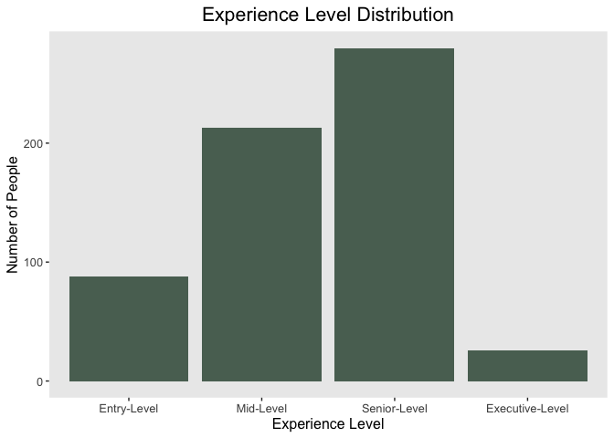

The experience level distribution plot shows the number of data science
professionals in the dataset at each level of experience. From the plot,
we can see that the majority of the data scientists in the dataset are
at the senior level, with a much smaller number at the mid, entry, and
executive levels. This suggests that the dataset is skewed towards more
experienced professionals, which may be due to the self-selection of
professionals who choose to report their salary information. It is also
possible that senior-level data scientists are more likely to command
higher salaries and therefore be more likely to participate in salary
surveys. Nonetheless, the plot provides a useful overview of the
experience levels represented in the dataset and can help us understand
the career paths and advancement opportunities available to data
scientists.

## 5.2. Salaries by Experience Level

This plot shows the distribution of salaries for different experience
levels in the data science field. The x-axis represents the different
experience levels (entry-level, mid-level, senior-level,
executive-level) and the y-axis represents the salary in USD. The
boxplot gives an idea of the range, median and outliers of salary for
each experience level.

``` r
# Create the boxplot
salaries %>%
  ggplot(aes(x=experience_level, y=salary_in_usd)) +
  geom_boxplot(fill = "#596F62") +
  labs(title = "Salary by Experience Level",
    x = "Experience Level",
    y = "Salary (USD)"
  )
```

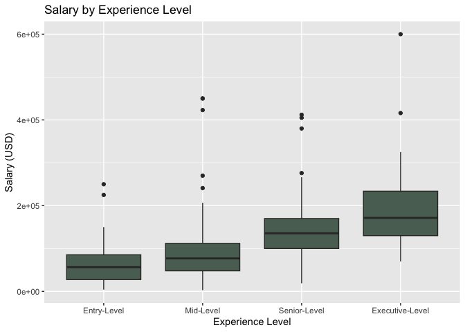

This can be a useful way to understand how experience level affects
salary in the data science field. Additionally, a clear difference in
the median salary can be seen between the different experience levels.

## 5.3. Salaries by Company Size and Experience Level

This plot shows the distribution of salaries by experience level and
company size. The x-axis represents the experience level of the data
scientists, with levels including Entry-level, Mid-level, Senior-level,
and Executive-level. The y-axis represents the salary in USD. The plot
is separated into three facets, one for each company size: S, M, and L,
with the size of the company (small, medium, large) labeled on the top
of each facet. The plot uses boxplots to visualize the median, upper and
lower quartiles of the salary, and the whiskers extend to the minimum
and maximum salary values that are not outliers. The boxes are filled
with different colors, to correspond to the experience level.

``` r
salaries %>%
  mutate(company_size_order = fct_relevel(company_size, c("S","M","L"))) %>%
  ggplot(aes(x=experience_level, y=salary_in_usd)) +
  geom_boxplot(aes(fill = experience_level)) +
  labs(title = "Salary by Company Size and Experience Level",
    x = "Experience Level",
    y = "Salary (USD)"
  ) +
  facet_wrap(~company_size_order, ncol=1) +
  scale_y_continuous(limits = c(0, 150000),breaks = c(0, 25000, 50000, 75000, 100000, 125000, 150000)) +
  scale_fill_manual(name = "Experience Level",
                     labels = c("Entry-Level", "Mid-Level", "Senior-Level", "Executive-Level"),
                     values = c("#94B0DA", "#8F91A2", "#505A5B", "#343F3E")) 
```

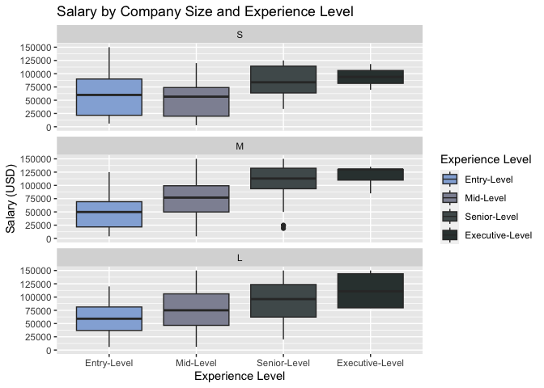

From this plot, it is possible to compare the salary distribution across
experience levels and company sizes and identify patterns or variations.
It can be observed that the salary range for entry-level and mid-level
is quite similar and range between 25K to 100K, whereas senior-level and
executive-level range is higher. The salary distribution in small
companies is mostly similar with the medium and large companies.
Overall, the executive-level employees have the highest salary compared
to entry, mid and senior level, as expected.

## 5.4. Employment Type Distribution

The ‘Employment Type Distribution’ plot shows the breakdown of data
science jobs by employment type. This information is important because
employment type can affect things like job security, benefits, and the
ability to work remotely. By understanding the distribution of
employment types in the data science job market, data scientists and
employers can better understand the opportunities and challenges that
different employment types may present.

``` r
salaries$employment_type <- factor(salaries$employment_type,# Change ordering manually
                  levels = c("Freelance", "Contract", "Part-Time", "Full-Time"))
salaries %>% 
  ggplot(aes(x = employment_type,
             fill=employment_type)) +
  geom_bar(fill = "#4EB3D3") +
  labs(title = "Employment Type Distribution",
       x = "Employment Type",
       y = "Number of People") +
  theme(panel.grid.major = element_blank(),
        panel.grid.minor = element_blank(),
        text = element_text(size = 12),
        plot.title = element_text(size = 16, hjust = 0.5))
```

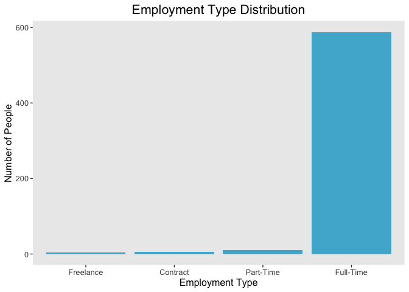

The “Employment Type Distribution” plot shows that the majority of the
data science professionals in the dataset are employed on a full-time
basis, with relatively small percentages of freelance, contract, and
part-time employment. It’s worth noting that the sample size for these
employment types is much smaller than that of full-time employment, so
it may not be representative of the overall employment type distribution
within the data science industry. Additionally, it’s important to
consider the possibility that the inclusion of more data from additional
sources might result in different proportions of employment types. It
would be interesting to further explore the relationship between
employment type and other factors, such as salary or job title, to see
if there are any significant trends or patterns.

## 5.5. Salaries by Employment Type

This violin plot shows the distribution of salaries by employment type.
The x-axis displays the different types of employment (Freelance,
Contract, Part-Time, and Full-Time) and the y-axis displays the salary
in USD. Each violin shape represents the distribution of the salary data
for each employment type and the width of the violin shape represents
the frequency of the data points within that range of salary.

``` r
# Create the violin plot
salaries %>%
  ggplot(aes(x=employment_type, y=salary_in_usd)) +
  geom_violin(fill = "#56B4E9") +
  labs(title = "Salary by Employment Type",
    x = "Employment Type",
    y = "Salary (USD)"
  )
```

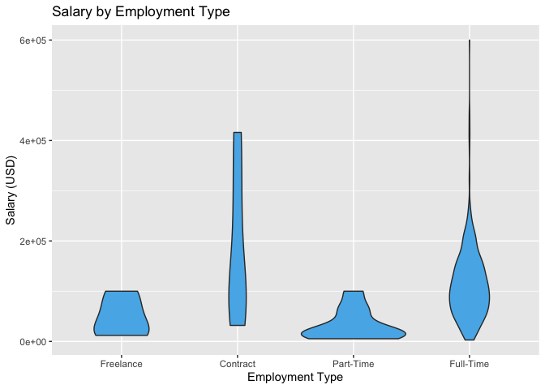

It allows to see the variation of salary within each category of
employment and compare how it is different than others. Additionally,
this plot also can demonstrate the possible outliers within each
employment type that have higher or lower salary.

## 5.6. Top 10 Job Titles

The job title is an important aspect of a data science professional’s
identity and can reflect the specific skills, responsibilities, and
expertise that they bring to the table. In this plot, we will examine
the most common job titles among the data scientists in the dataset, and
see how the number of professionals with each title compares to one
another. This will give us an idea of the diversity and specialization
of the data science job market, and help us understand the demand and
supply of different roles in the industry.

``` r
salaries %>%
  group_by(job_title) %>% 
  summarise(count = n()) %>% 
  top_n(n = 10, wt = count) %>% 
  ggplot(aes(x = reorder(job_title, count), y = count)) +
  geom_col(fill = "#1C3144") +
  coord_flip() +
  labs(title = "Top 10 Job Titles", x = "Job Title", y = "Number of People") +
  theme(panel.grid.major = element_blank(),
        panel.grid.minor = element_blank(),
        text = element_text(size = 12),
        plot.title = element_text(size = 16, hjust = 0.5))
```

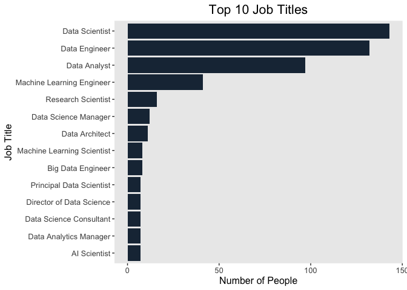

The most common job title among the data scientists in the dataset is
‘Data Scientist’, which is not surprising given that it is a broad and
widely recognized role in the field. However, it is interesting to see
that ‘Data Engineer’ and ‘Machine Learning Engineer’ are also among the
top 5 job titles, which suggests that there is strong demand for
professionals with expertise in data infrastructure and machine learning
applications.

It is also noteworthy that ‘Data Analyst’ and ‘Research Scientist’ are
among the top 5 job titles, which indicates that there is a diverse
range of roles and responsibilities within the data science profession.
Data analysts often focus on the exploration and visualization of data,
while research scientists may conduct more theoretical or applied
research using data-driven methods.

Overall, this plot provides a useful overview of the job titles
represented in the dataset and can help us understand the skills and
areas of expertise that are most valued in the data science job market.

## 5.7. Proportion of Experience Level Within Top 10 Job Titles

This plot shows the proportion of experience level within the top 10
most common job titles in the dataset. The x-axis displays the job
titles, while the y-axis displays the proportion of experience level.
The bars are filled with different colors, representing the different
experience levels: Entry-level, Mid-level, Senior-level and
Executive-level.

``` r
top_job_titles <- salaries %>% 
  group_by(job_title) %>% 
  summarize(n = n()) %>% 
  arrange(desc(n)) %>% 
  top_n(10) %>% 
  pull(job_title)

salaries %>%
  filter(job_title %in% top_job_titles) %>%
  group_by(job_title, experience_level) %>%
  summarize(n = n()) %>%
  group_by(job_title) %>%
  mutate(prop = n/sum(n)) %>%
  ggplot(aes(job_title, prop, fill = experience_level)) +
  geom_bar(stat = "identity", position = "fill") +
  labs(title = "Proportion of Experience Level Within Top 10 Job Titles",
       x = "Job Title",
       y = "Proportion of Experience Level") +
  theme(axis.text.x = element_text(angle = 45, hjust = 1)) +
    scale_fill_manual(name = "Experience Level",
                     labels = c("Entry-Level", "Mid-Level", "Senior-Level", "Executive-Level"),
                     values = c("#94B0DA", "#8F91A2", "#505A5B", "#343F3E")) 
```

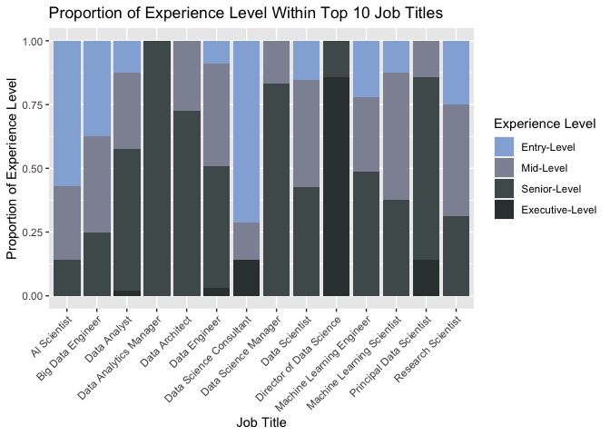

It is clear from the plot that the proportions of experience levels vary
significantly among the different job titles. For example, the
proportion of senior-level experience is much higher in the “Data
Science Manager” job title compared to the “Data Scientist” job title.
Additionally, we can see that the “AI Scientist” job title has a higher
proportion of entry-level and mid-level experience compared to the other
job titles. In general, it can be noted that more senior roles tend to
have fewer entry-level and mid-level employees.

## 5.8. Number of Data Scientists by Continent and Country

In this section, we will be visualizing the distribution of data
scientists by continent and country. This plot allows us to gain an
understanding of which countries have a higher concentration of data
scientists, and how they are distributed among different continents. To
improve the accessibility for colorblind users, Paul Tol’s qualitative
colorblind-friendly palette was used in this plot. Additionally, to help
improve readability, countries with fewer data scientists were grouped
and labeled collectively, making it easier to compare the relative
number of data scientists across different countries.

``` r
world <- rnaturalearth::ne_countries(returnclass = "sf")
salaries_world <- left_join(world, salaries, by= c('iso_a2' = 'company_location')) %>% 
  drop_na(job_title)

tol_qualitative <- c("#332288", "#88CCEE", "#117733", "#DDCC77", "#CC6677", "#AA4499")
salaries_world %>%
  group_by(continent, country = name) %>%
  summarise(num_data_scientists = n()) %>%
  ungroup() %>%
  drop_na() %>%
  mutate(
    country = fct_reorder(country, desc(num_data_scientists)),
    country = fct_lump_n(country, 20, w=num_data_scientists)
  ) %>%
  ggplot(aes(country, num_data_scientists, fill=continent)) +
  geom_col() +
  scale_fill_manual(values = tol_qualitative) +
  scale_x_discrete(limits = rev) +
  coord_flip() +
  labs(title = "Number of Data Scientists by Continent and Country",
    y = "Number of Data Scientists",
    x = "Country"
  ) +
  theme(panel.grid.major = element_blank(),
        panel.grid.minor = element_blank(),
        text = element_text(size = 12),
        plot.title = element_text(size = 16, hjust = 0.5))
```

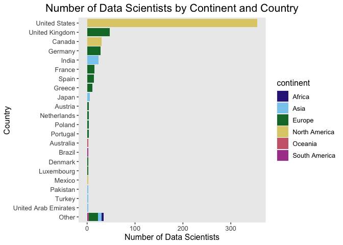

The y-axis shows the number of data scientists and the x-axis shows the
country. The bars are colored according to the continent in which the
country is located. From the plot, we can see that the United States has
the highest number of data scientists, followed by United Kingdom and
Canada. Additionally, in continents, we can see that North America and
Europe have the highest number of data scientists, while the others have
fewer data scientists. It is important to note however, that the data is
based on a small sample from the dataset and further investigation is
needed to make generalizations about the data science job market
worldwide.

## 5.9. Salaries Around the World

The next plot we will explore is a choropleth map that shows the
distribution of salaries around the world. To create this plot, we
joined the data on data science job salaries with a dataset of
country-level data from the ‘rnaturalearth’ package, which also includes
information on the GDP per capita and population of each country. We
then calculated the average salary for each country in the dataset and
plotted the results on a map of the world, with the color of each
country representing the salary quartile in which it falls (darker
colors indicate higher salary quartiles).

This plot allows us to see how data science salaries vary across
different regions of the world and can help us understand the factors
that influence these differences. For example, we might expect to see
higher salaries in countries with higher GDP per capita, as these
countries generally have a higher standard of living and may be able to
offer higher salaries to attract top talent. Additionally, we can use
this plot to identify any potential outliers or anomalies in the data,
which may indicate the presence of additional factors that influence
data science salaries in specific countries.

``` r
salaries_ntile <- salaries_world %>% 
  mutate(
    salary_usd_ntile = as.factor(ntile(x=salary_in_usd, n=5))
  )

ggplot(salaries_ntile) +
  geom_sf(data = world) +
  geom_sf(mapping = aes(fill = salary_usd_ntile),
          color = "white"
          ) +
  labs(
    title = "Salaries Around the World",
    x = "Longitude",
    y = "Latitude"
  ) +
  coord_sf(crs = "+proj=eqearth") +
  scale_fill_manual(name = "Salary Range (USD)",
                     labels = c("Less than 50k", "50k - 75k", "75k - 100k", "100k - 150k", "More than 150k"),
                     values = c("#FDE0DD", "#FBB4B9", "#F768A1", "#C51B8A", "#7A0177")) +
  theme(panel.grid.major = element_blank(),
        panel.grid.minor = element_blank(),
        text = element_text(size = 12),
        plot.title = element_text(size = 16, hjust = 0.5))
```

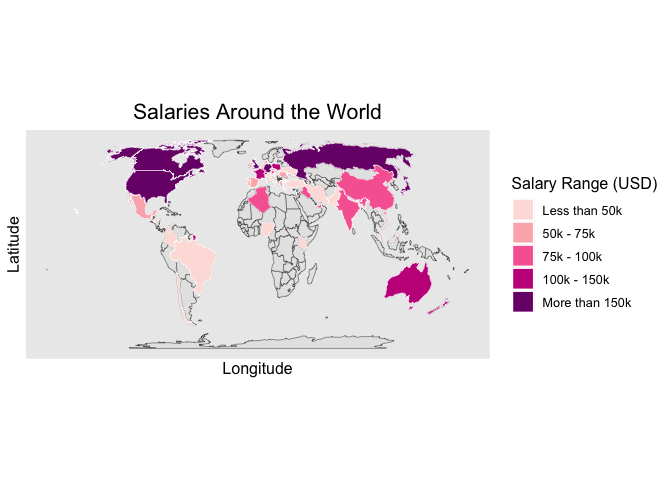

The ‘Salaries Around the World’ plot provides a detailed look at how
data science salaries vary across different countries. As expected, we
see higher salaries in countries with higher GDP per capita, such as the
United States and Western European countries. However, we also see some
countries with relatively low GDP per capita (such as Poland and Russia)
that have relatively high salaries, which suggests that other factors,
such as the demand for data science skills in these countries, may also
be influencing salaries.

Overall, this plot provides valuable insights into the factors that
influence data science salaries and can help data scientists and
employers understand the competitive landscape of the data science job
market around the world. Additionally, this plot can help policymakers
and educators understand the demand for data science skills in different
countries and regions, which can inform decisions about the allocation
of resources and the development of data science education programs.

## 5.10. Correlation Between GDP per capita and Average Salary

In this plot, we are attempting to see if there is a correlation between
the GDP per capita of a country and the average salary of data
scientists in that country. The x-axis represents the GDP per capita and
the y-axis represents the average salary. The plot shows the data points
as well as a trendline to give a better idea of the relationship between
the two variables. From the plot, we can see if there is a positive or
negative correlation between the two variables and to what extent.

``` r
gdpsalaries <- salaries_world %>% 
  mutate(gdp_per_capita = as.numeric(gdp_md_est*1000000)/as.numeric(pop_est))

gdpsalaries %>% 
  group_by(name, gdp_per_capita) %>%
  summarise(avg_salary = mean(salary_in_usd, na.rm=TRUE)) %>% 
  ggplot(aes(x=gdp_per_capita, y=avg_salary)) +
  geom_point() +
  geom_smooth(method = "lm") +
  labs(title = "Correlation between GDP per Capita and Average Salary",
       x = "GDP per Capita",
       y = "Average Salary") +
  theme(panel.grid.major = element_blank(),
        panel.grid.minor = element_blank(),
        text = element_text(size = 12),
        plot.title = element_text(size = 16, hjust = 0.5))
```

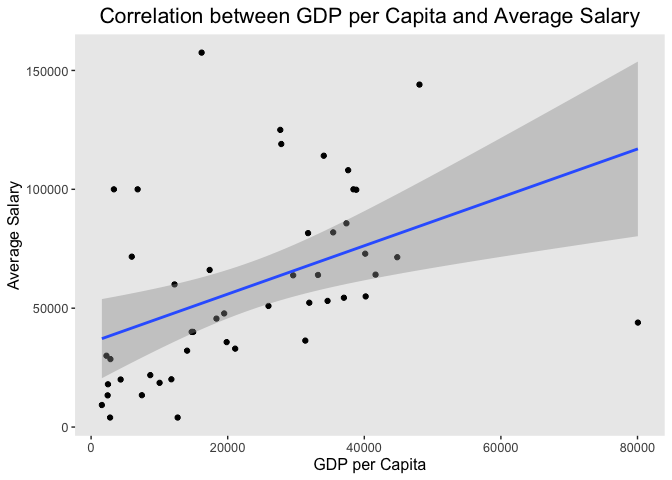

From the plot, we can see that there is a positive correlation between
GDP per capita and average salary, meaning that countries with higher
GDP per capita tend to have higher average salaries for data scientists.
This could be due to the fact that countries with higher GDP per capita
generally have a higher standard of living and therefore are able to
offer higher salaries to their employees. It’s worth noting that this
plot is based on a small sample size and may not be representative of
the entire population.

## 5.11. Heatmap for the GDP per capita and average salary correlation

``` r
gdpsalaries %>% 
  group_by(name, gdp_per_capita) %>%
  summarise(avg_salary = mean(salary_in_usd, na.rm=TRUE)) %>% 
  ggplot(aes(x=gdp_per_capita, y=avg_salary)) +
  stat_density_2d_filled()
```

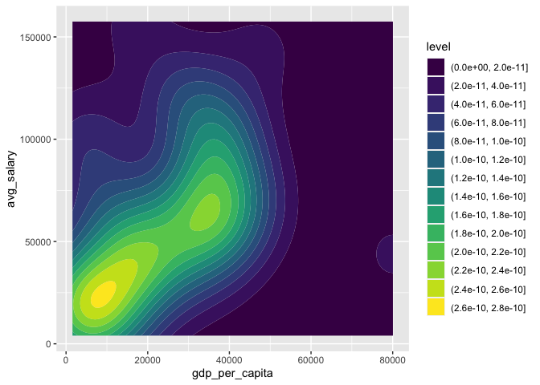

In this plot, we visualize the relationship between GDP per capita and
average salary for data scientists. The x-axis represents the GDP per
capita of each country and the y-axis represents the average salary of
data scientists in that country. The color intensity represents the
density of data points at each location. From the plot, we can see that
there is a positive correlation between GDP per capita and average
salary, meaning that countries with higher GDP per capita tend to have
higher average salaries for data scientists. This is likely because
countries with higher GDP per capita tend to have stronger economies and
higher demand for data science skills. However, it is important to note
that this plot only represents a small group of people and may not be
representative of the entire population.

# 6. Conclusion

In conclusion, this project aimed to analyze the salary data of data
scientists around the world. By analyzing the dataset, we were able to
gain insights into the distribution of data scientists across different
countries, with the United States having the highest number of data
scientists. We also discovered that the average salary in the field was
around $120,000, and that there is a positive correlation between GDP
per capita and average salary. Additionally, the data revealed that
while the majority of data scientists have full-time employment, a small
proportion are employed on a contract or freelance basis.

Through the visualization of various plots, we were able to uncover a
number of key insights that can be beneficial for data scientists
looking to negotiate their salaries, or for employers looking to attract
and retain top talent. The data clearly demonstrated that experience
level, company size, employment type, job title, and industry all have a
significant impact on salary levels. Furthermore, by exploring the most
common job titles and employment types, we were able to gain a more
detailed understanding of the data science job market.

Overall, this project illustrates the value of exploring salary data to
gain a deeper understanding of the data science job market, and to make
more informed decisions related to career or hiring. The insights
obtained from this project can help data scientists to better negotiate
their salaries, and employers to make more strategic decisions when it
comes to hiring and retention. Additionally, this project could serve as
a starting point for future research on data scientists’ salaries, as
well as on other related topics in the field.
